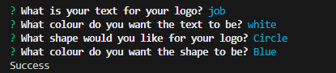

# SVG-Logo-Maker-Node-JS

Node js command-line application that takes users inputs and then generates a logo with the file type of SVG (Scalable Vector Graphic)

## Table of Content

- [Walkthrough Video](#walkthrough-video)
- [User Story & Acceptance Criteria](#user-story)
- [What I have learnt](#what-i-have-learnt)
- [Installation](#installation)
- [Usage](#usage)
- [Test](#test)

## Walkthrough Video

[Walkthrough](youtube.com)

## User Story

```md
AS a freelance web developer
I WANT to generate a simple logo for my projects
SO THAT I don't have to pay a graphic designer
```

## Acceptance Criteria

```md
GIVEN a command-line application that accepts user input
WHEN I am prompted for text
THEN I can enter up to three characters
WHEN I am prompted for the text color
THEN I can enter a color keyword (OR a hexadecimal number)
WHEN I am prompted for a shape
THEN I am presented with a list of shapes to choose from: circle, triangle, and square
WHEN I am prompted for the shape's color
THEN I can enter a color keyword (OR a hexadecimal number)
WHEN I have entered input for all the prompts
THEN an SVG file is created named `logo.svg`
AND the output text "Generated logo.svg" is printed in the command line
WHEN I open the `logo.svg` file in a browser
THEN I am shown a 300x200 pixel image that matches the criteria I entered
```

## What I have learnt

This week we have been focusing on OOP (Object Orinated Programming) which is where you have your program set up in classes so that it is easier to add functionality to all the classes and furthermore, when set up properly it is easier for people to read.

On the otherhand, in my opinion it's hard to initialy setup the OOP structure because you have to think about how everything will connect together before you have started and if you don't, it cause me to do a lot of re-writing to fix mine. Once you have the correct layout for your OOP, then it is easy to add new functionality to all the classes as all you have to do, is add it to the Parent class and then polymorphism your children, to do the wanted functionality.

## Installation

Clone the project and then in the terminal run:

```bash
npm i;
```

## Usage

### Run the project

Run the app by using:

```bash

npm run start

```

### Put in your paramaters for the logo



### Open the SVG

Find logo.svg and then RMB and then press Preview SVG


## Test

```bash

npm run test

```
